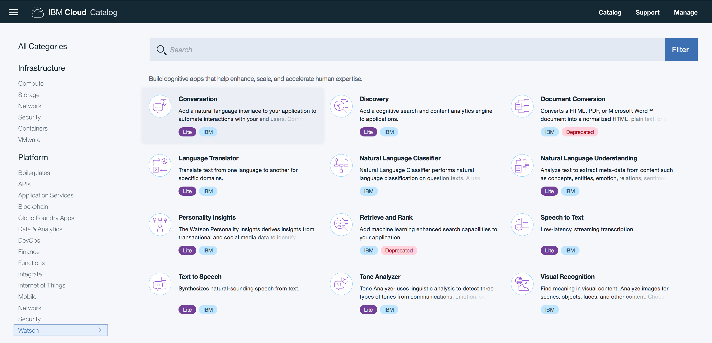
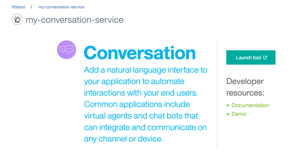
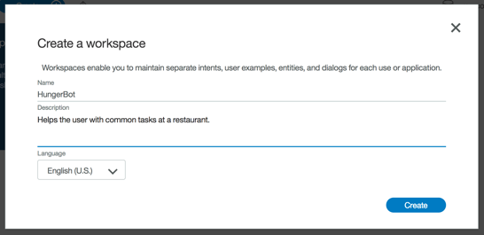
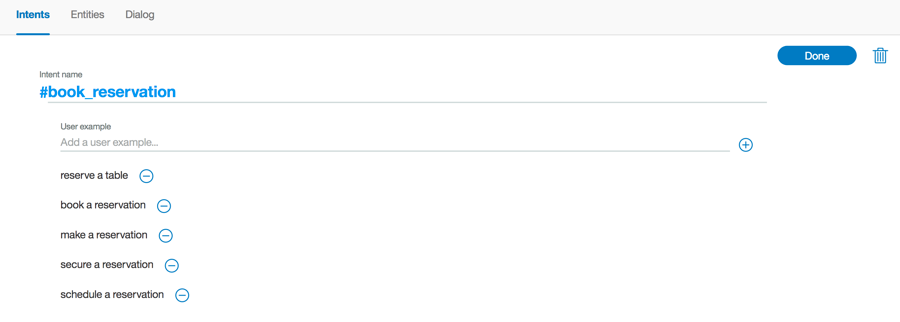
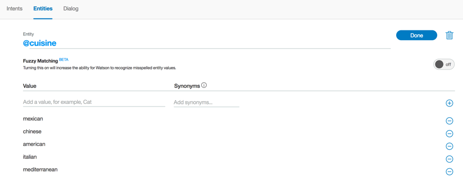
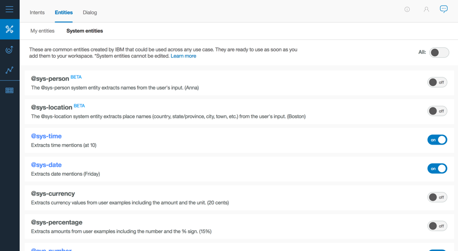
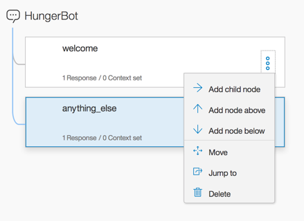
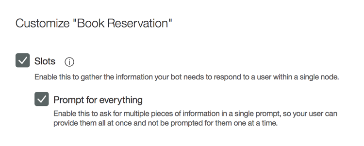
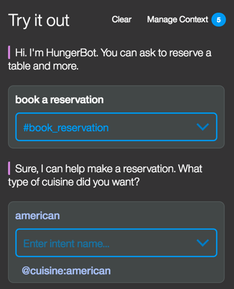

# Introduction to Watson Assistant

Watson Assistant service combines machine learning, natural language understanding, and integrated dialog tools to create conversation flows between your apps and your users. In this lab, you will create a workspace and understand the terminology of creating a chatbot.

# Before you begin

To complete this workshop you will need:
- IBM Cloud account

**Creating your IBM Cloud account**

1. [Sign up for an account here](https://ibm.biz/BdZFpJ)
2. Verify your account by clicking on the link in the email sent to you
3. Log in to your IBM Cloud account

# Step 1: Designing Your Bot

Building a chatbot with Watson Assistant is so easy, some developers choose to dive right into the tooling. However, with a well-thought out, well-planned chatbot, the interaction with the user can lead to a much better experience that can handle edge cases. In this section, we will design the interaction between a user, Dave, and a chatbot named HungerBot.

A good question to ask yourself is, "Who is my user and what problem do they have?" Expand on the user's profile by determining what the user needs from this chatbot. Does the user have a need to book a reservation at a restaurant? Or an answer to a common question like "Where's the bathroom?" at a conference. Maybe a chatbot that handles tasks like turning on lights or other equipment. It might help to think of the chatbot as an automated version of an existing agent, such as a customer service agent. Look at existing processes that include repeated manual processes, which can sometimes be augmented with chatbots.

Training a chatbot is like training a human agent. You will train the chatbot with the knowledge of certain tasks (intents) and things that these tasks interact with (entities). These components are then combined to create a dialog tree that can take one or more paths to respond to the user's request.

In the following steps, we have provided a sample restaurant chatbot that handles reservations for a restaurant. On the right side, it's your turn to create your own chatbot. Fill in the blanks to design your chatbot.

1.  Envision the user that interacts with the bot.

    |Example:|Your turn:|
    |------------------------------------------------|------------------------------------------|
    |A user, named Dave, needs to book a table at the restaurant.|A user, named _______________________, needs to _______________________________________.|

2.  Now, let's give the chatbot a name and describe the overall function it can help with.

    |Example:|Your turn:|
    |------------------------------------------------|-----------------------------------------|
    |The chatbot, named HungerBot, can help the user with common tasks at a restaurant.|The chatbot, named _______________________, can help the user with ________________________.|

3.  It can be helpful to take a snapshot of an existing dialogue and then break it down into intents and entities. A sample conversation is shown below. Keep the conversation simple…you can always add more complex logic later.

    |Example:|Your turn:|
    |------------------------------------------------|-----------------------------------------|
    |HungerBot: Hi, I'm HungerBot. You can ask to reserve a table and more.|Bot: |
    |Dave: I want to book a table.|User: |
    |HungerBot: What type of cuisine would you like?|Bot: |
    |Dave: I like American food|User: |
    |HungerBot: When do you want to book a table?|Bot: |
    |Dave: Tonight|User: |
    |HungerBot: How many people will be coming?|Bot: |
    |Dave: Five people|User: |
    |HungerBot: Excellent! Here are the details of your booking.|Bot: |

4.  Let's start with the action the user wants to do, which is referred to as an intent. Write a human-friendly description of the action the user is wanting to perform. List at least five ways the user might phrase this action. Lastly, add a label, like a variable name in code (alpha-numeric, underscores, etc.), that can be used later as a reference.

    |Example:|Your turn:|
    |------------------------------------------------|-----------------------------------------|
    |Intent: book a reservation|Intent: |
    |Variations||
    |1.  Reserve a table|1.|
    |2.  Book a reservation|2.|
    |3.  Make a reservation|3.|
    |4.  Secure a reservation|4.|
    |5.  Schedule a reservation|5.|
    |Label: #book_reservation|Label: #|

  	If you find that you don't have many variations, invite a friend (or a real user!) to suggest how they would ask "*to book a reservation.*" In the real world, you could use customer interactions as a base of inspiration or use a thesaurus.

5.  Another component to training a chatbot is recognizing objects, which is referred to as an entity. This example reservation system can differentiate different types of cuisine. We add a type of cuisine to booking a reservation.

    |Example:|Your turn:|
    |------------------------------------------------|-----------------------------------------|
    |Entity: type of cuisine|Entity:|
    |Variations:||
    |1. Mexican|1.|
    |2. Chinese|2.|
    |3. American|3.|
    |4. Italian|4.|
    |5. Mediterranean|5.|
    |Label: @cuisine|Label: @|

    We could add time and number entities, however, there are some built-in system entities provided by IBM, like numbers, dates, and times, that the HungerBot will use. If you have another entity, define the additional entity in a new table.

In the Dialog editor of Watson Assistant, we can now setup logic to step the user through the conversation. In the next section, we will use this design to train the Watson Assistant service.

# Step 2: Train Watson Assistant Service

Now that we have designed the first dialogue between the chatbot and the user, we can train the Watson Assistant service. Sign up for an IBM Cloud account at bluemix.net. If you already have an account, sign into your account.

1.  **Click on the Catalog** link in the top-right corner of the IBM Cloud dashboard.

2.  **Select the Watson Assistant** tile under the section titled Watson.

    

3.  Enter `my-assistant-service` in the field labeled Service name. Click on **Create**.

    

4.  Click on the green **Launch tool** button to launch into the Watson Assistant tooling.

    

5.  This is the Watson Assistant tooling where you can create workspaces and setup different chatbots dialogues and applications. There is an example Cognitive Car Dashboard workspace where you can see a more evolved training. However, we'll create a new workspace for our bot to use. Click on the **Create** button in the box labeled **Create a new workspace**.

    

6.  Enter a name for the chatbot and a description. Click **Create** when finished.

    

7.  You will be redirected into a page with three tabs, Intents, Entities, and Dialog. Under the Intents tab, click on **Create new** to create the first intent.

8.  Use the answers you wrote in Step 1 to create the first intent. Click on **Done** when finished.

    

9.  **Click on the Entities** tab in the top menu bar. This is where you can add entities. Add the entity you wrote in Step 1. Click **Done** when finished.     

    

10. The Watson Assistant has a handful of common entities created by IBM that can be used across any use case. These entities include: date, time, currency, percentage, and numbers. **Click on System entities**. Toggle on the switch for `@sys-time`, `@sys-date`, and `@sys-number` to enable the entities.

    

11. **Click on the Dialog tab** in the top menu bar. Click **Create**. There are two nodes added by default. The `welcome` condition is triggered when the chatbot is initially started. This is a good place to introduce the bot and suggest actions the user can ask of this chatbot.    

    

12. The second node checks for the condition `anything_else`. In the event the user enters something that wasn't expected, the service will return this response. Ideally, it should convey a way for the user to recover, such as example phrases.    

    

13. Return back to the `welcome` node and click on the three dots on the right side of the node. Select **Add node below** from the menu.    

    

14. Add a node to test the condition of the first intent, `#book_reservation`, as shown below.     

    

15. **Click on Customize** in the top right corner. Enable Slots and Prompt for everything.

    

16. Add a slot for `@cuisine`, with the prompt `What type of cuisine would you like?`    

    

17. Add another slot for `@sys-date`, with the prompt `What day would you like to reserve?`    

    

18. Add another slot for `@sys-time`, with the prompt `What time would you like to reserve?`    

    

19. Add another slot for `@sys-number`, with the prompt `How many people will be coming?`    

    

20. If no slots are prefilled, prompt the user to provide a cuisine.    

    

21. Have the bot respond with the details of the reservation. The <? … ?> syntax uses the values stored in the context and injects the values into the response.

    

# Step 3: Test Watson Assistant Service

The Watson Assistant tooling offers a testing panel to test phrases to confirm the correct intents, entities, and dialog are matched and returned.

1.  To test the bot, **click on the Ask Watson icon** in the top-right corner of the tooling.    

    

2.  A side panel appears and shows the contents of the node that matches welcome. Enter a message that triggers the `#book_reservation` intent. We can ask `book a table`    

    

3.  Notice that the intent `#book_reservation` was recognized. The `#book_reservation` node was triggered and the output includes the response from the Book Reservation node. The user is prompted for a choice of cuisine.     

    

4.  When the user enters a cuisine, the `@cuisine` entity is recognized.     

    

5.  When the user enters a date or time, Watson extracts out the value using the system entities `@sys-date` and `@sys-time`.     

    

6.  Finally, when the user enters a number (either numerically or spelled out) for the number of people in the reservation, Watson extracts out the number using the system entity `@sys-number`.    

       

## Summary

The Watson Assistant service was able to handle gathering multiple pieces of information, parsing the user input, and placing the values into a context that was used to inject into the response back to the user.

## License

© Copyright IBM Corporation 2017

IBM, the IBM logo and ibm.com are trademarks of International Business Machines Corp., registered in many jurisdictions worldwide. Other product and service names might be trademarks of IBM or other companies. A current list of IBM trademarks is available on the Web at &quot;Copyright and trademark information&quot; at www.ibm.com/legal/copytrade.shtml.

This document is current as of the initial date of publication and may be changed by IBM at any time.

The information contained in these materials is provided for informational purposes only, and is provided AS IS without warranty of any kind, express or implied. IBM shall not be responsible for any damages arising out of the use of, or otherwise related to, these materials. Nothing contained in these materials is intended to, nor shall have the effect of, creating any warranties or representations from IBM or its suppliers or licensors, or altering the terms and conditions of the applicable license agreement governing the use of IBM software. References in these materials to IBM products, programs, or services do not imply that they will be available in all countries in which IBM operates. This information is based on current IBM product plans and strategy, which are subject to change by IBM without notice. Product release dates and/or capabilities referenced in these materials may change at any time at IBM&#39;s sole discretion based on market opportunities or other factors, and are not intended to be a commitment to future product or feature availability in any way.

***
